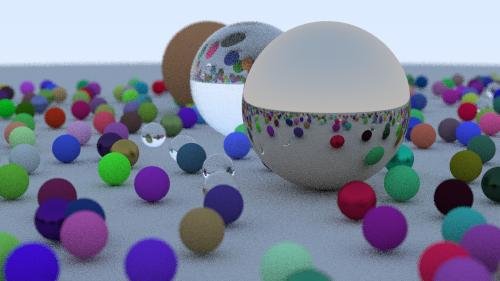

# **RayTracingAndrzejWrzesinski**

Projekt polegal na zaimplementowaniu programu generujacego obraz w formacie JPEG, przedstawiajacy zbior kul/sfer,
imitujacych rozne rodzaje materialow: szklo, dielektryk czy metal. Tworzenie imitacji tych bryl zostalo utworzone za pomoca metody Ray Tracing'u.
Koncowy obraz sklada sie z 3 glownych kul, razem z ponad 200 innymi mniejszymi. Obraz jest generowany w standardowych proporcjach 9 : 16,
dla szerokosci 500px.

